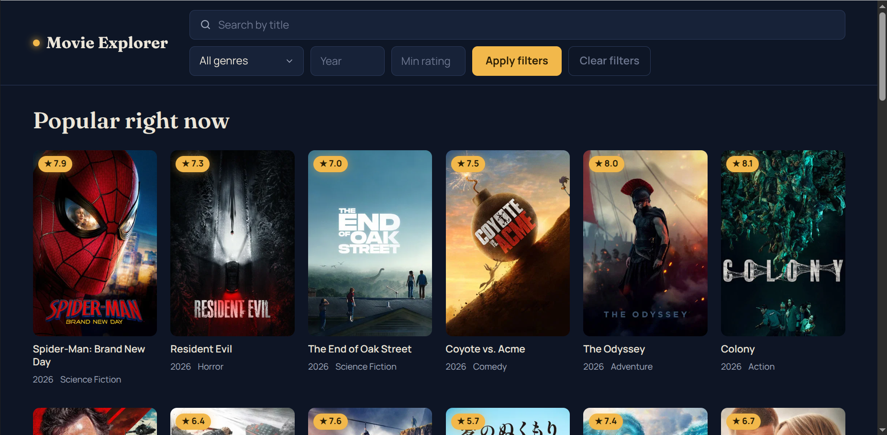
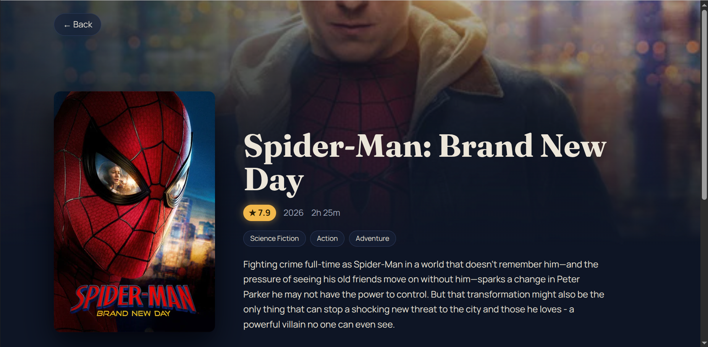
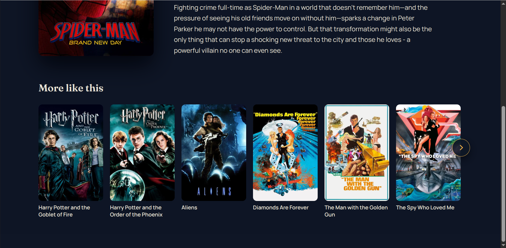
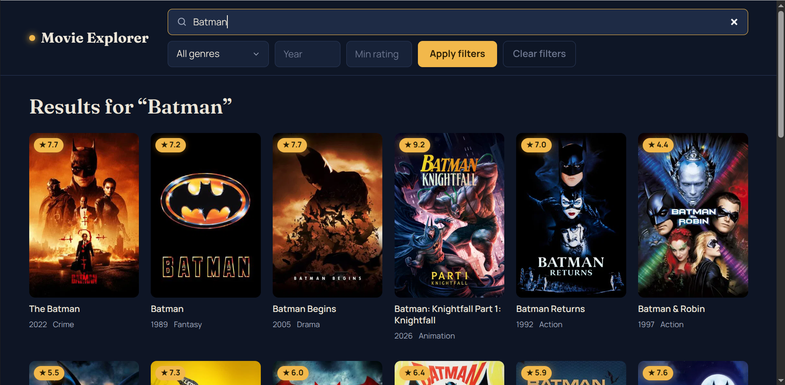

# Movie Explorer Dashboard

A movie discovery app built with **React**, **TypeScript**, and **Vite**, powered by the **TMDB API**. Browse popular movies with infinite scroll, search the full TMDB catalog, filter by genre/year/rating, and view detailed movie info with related titles — all in a dark, poster-grid interface.

## Screenshots

| Home | Movie Details |
|---|---|
|  |  |

| Related Movies Carousel | Search Results |
|---|---|
|  |  |

## Features

- Browse popular movies with infinite scroll
- Search movies by title, debounced and fetched live from TMDB (not limited to already-loaded results)
- Filter by genre, release year, and minimum rating, applied via an **Apply filters** button (with a **Clear filters** option)
- Movie details page with overview, release date, runtime, rating, genre chips, and backdrop
- Related movies shown as a **carousel** on the details page, with its own independent pagination
- Genre names resolved and shown on each movie card
- Loading, empty, and error states throughout — while browsing, while searching, and at the end of results
- A safety limit on auto-loading when filters match very few movies, with a **Load more** button so the app never silently fetches hundreds of pages by itself
- A custom-styled genre dropdown and a Netflix-style movie carousel with arrow navigation

## Tech Stack

- React 19 + TypeScript + Vite
- TMDB API (`https://api.themoviedb.org/3`)
- No UI library — custom components and CSS

## Getting Started

1. Clone the repo and install dependencies:
   ```bash
   git clone <this-repo-url>
   cd Movie-Explorer
   npm install
   ```

2. Create a `.env` file in the project root:
   ```
   VITE_TMDB_API_KEY=your_tmdb_api_read_access_token_here
   VITE_TMDB_BASE_URL=https://api.themoviedb.org/3
   VITE_TMDB_BASE_IMAGE_URL=https://image.tmdb.org/t/p/w500
   ```
   You can get a free API key/read access token at [themoviedb.org](https://www.themoviedb.org/settings/api).

3. Start the dev server:
   ```bash
   npm run dev
   ```
   Then open the local URL shown in your terminal (usually `http://localhost:5173`).

## Architecture

- **`useFetch`** — reusable data-fetching hook (loading/data/error state, `AbortController` cleanup, and an `isFetchingRef` for tracking in-flight requests synchronously)
- **`useInfiniteScroll`** — wraps an `IntersectionObserver` behind a callback ref, so the sentinel element is observed reliably even when it mounts after the initial render (e.g. once search results arrive), and restarts once per page load so filtered lists that grow slowly still keep scrolling
- **`useDebounce`** — delays reacting to fast-changing input (used for search) until the user stops typing
- **`filterMovies`** (in `utils/`) — applies genre/year/rating filters to a movie list; used with `useMemo` so filtering only re-runs when the list or the applied filters actually change
- **`Home.tsx`** — handles popular-movie browsing and search as two independent flows, each with its own page counter, "has more" tracking, and accumulated results, so switching between them doesn't cause one to affect the other
- **`MovieList` / `MovieCard`** — presentational components; `MovieCard` resolves genre IDs to names via a lookup map passed down from `Home`, and the whole card is a clickable link
- **`GenreSelect`** — a custom-styled dropdown (the native `<select>` list can't be capped in height or restyled)
- **`MovieCarousel`** — a horizontally-scrolling row with arrow buttons, used for related movies
- **`MovieDetails.tsx`** — fetches a movie's details and its related movies as two independent requests

## Notable Decisions

- Search hits TMDB's `/search/movie` endpoint directly instead of filtering already-loaded popular movies, so results reflect TMDB's full catalog.
- Genre/year/rating filtering happens client-side (via `filterMovies` + `useMemo`), applied only when the user clicks **Apply filters** — so typing or picking a value doesn't re-filter or re-fetch on every keystroke.
- Popular-movie browsing and search keep fully separate state, so switching between them doesn't cause one to affect the other.
- In-flight/has-more tracking inside the scroll logic uses refs rather than state, since state updates are asynchronous and can lag behind a quick sequence of scroll events.
- The scroll intersection handler is wrapped in `useCallback` to keep a stable function reference, preventing the observer from being torn down and recreated on every render — and the hook restarts once per loaded page so a filter that only matches a few movies per page doesn't get "stuck" waiting for a scroll that never changes anything.
- When a filter combination matches very few movies, the app auto-loads up to 5 pages looking for matches, then stops and shows a **Load more** button, rather than silently fetching hundreds of pages.

## Known Limitations

- TMDB's search endpoint can occasionally return the same movie on more than one results page; duplicate-key warnings may show up during long search sessions (deduplication not yet implemented).
- No automated tests yet.
- Styling is responsive but not pixel-perfect.

## Bug Runbook

Detailed write-ups of the trickier bugs found while building infinite scroll (stale closures, callback refs, observer restart timing) are documented separately in `BUG_RUNBOOK.md`.